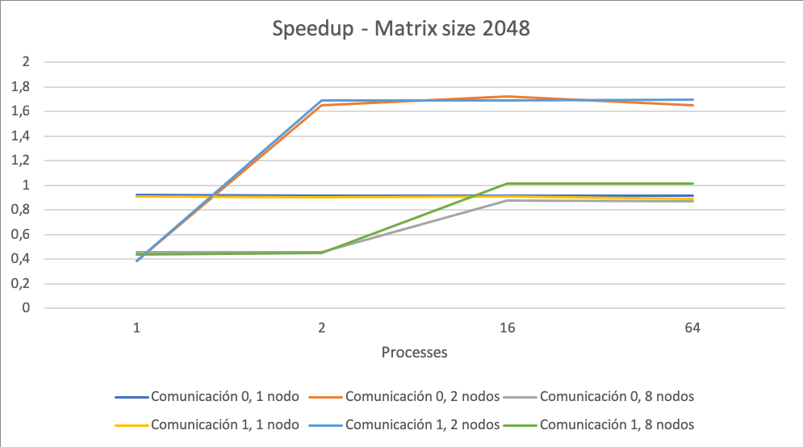
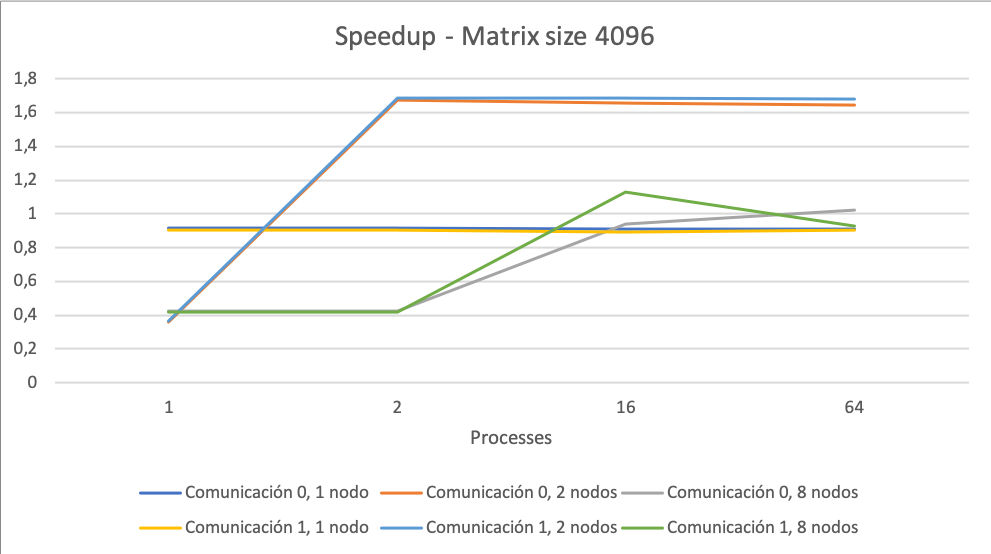

# Gauss Seidel using MPI

This small project contains the implementation of the <a href="https://en.wikipedia.org/wiki/Gauss–Seidel_method">Gauss Seidel linear equations solver</a>, using <a href="https://en.wikipedia.org/wiki/Message_Passing_Interface">MPI</a> for parallelizing the load over distributed computers. The Gauss Seidel method for solving linear equations is an iterative method, in which the values for the given variables keep changing until a certain threshold of variance is reached.

The goal of this projet was to provide a faster resolution time than the sequential version of the code, which is also provided in the repository.

<br>

## How does it work?

### General phases:


In order to parallelize the calculations, certain data dependency constraints need to be omitted. This constraint relaxation will only mean that the *solver* function will take longer iterations to reach the predefined *threshold*. However, this is fine with us, as **the speed up that we achieve by splitting the calculation, is way higher than the cost of a couple more iterations**.

### Parallelization steps:

<b>1. Decomposition:</b> each process will execute the *solver* function over a set of rows. Given data dependency with the cells above and below the target one, the number of matrix rows given to each node is **N+2**, being **N**, the number of rows that node needs to compute.

<b>2. Assignation:</b> in order to assign rows to nodes, we have applied the following logic:

```C
int max_rows_per_node = (int)(ceil((n-2) / num_nodes) + 2;
int node_rows = max_rows_per_node * n;           

// Case in which the node receive the full set of elements
if (node_offset + node_elems <= (n*n)) {
	return node_elems;
}

// Case of the last node, which could get less elements
else {
	return (n*n) - node_offset;
}
```

**DISCLAIMER:** This logic is splitted between *get_max_rows( )* and *get_node_rows( )*.

<b>3. Orchestation:</b> In order to split the rows among the nodes, MPI built-in functions are used. We provided 2 types of communications between the nodes:

​	A) Point-to-point: uses *MPI_Send( )* and *MPI_Recv( )*.

​	B) Collective: uses *MPI_Scatterv( )* and *MPI_Gatherv( )*.

<b>4. Mapping:</b> Finally, a mapping between the computational units (processes), and hardware components (processors cores in different machines) needs to be made. In order to specify the number of machines to distribute the processes, a *machines.txt* file need to be created, with the public IPs of those machines.

**DISCLAIMER:** In our specific case, we named the machines by nicknames, and not IPs.

<br>

## What is in the repository?

The repository contains:

- <b>Sequential code version</b> (*gc_seq.c*).
- <b>MPI code version</b> (*gs_mpi.c*).
- <b>MPI machines file</b> (*machines_1x1.txt*).
- <b>Bash script:</b> for executing with multiple configurations (*exec_mach_1x1.sh*).
- <b>Makefile:</b> used to compile and clean the project.

<br>

## Usage

First of all, **the MPI compiler needs to be installed**. Later on, the code needs to be compiled by using the following shell command:

```shell
$ make
```

Once the code is compiled, it can receive 2 arguments:

- <b>Matrix size:</b> usually a power of 2 (64, 128, 256, 1024...).
- <b>Communication type</b>: 0 for *point-to-point* and 1 for *collective*.

The execution command will be as follows:

```shell
$ mpiexec -f <machines_file> -np <num_nodes> -ppn <processes_per_node> ./gs_mpi <matrix_size> <communication>
```

Example:

```shell
$ mpiexec -f machines_1x1.txt -np 2 -ppn 4 ./gs_mpi 1024 0
```

<br>

## Results

As the whole goal of this project was to speed-up the resolution of the linear equation system, it is important to state the obtained acceleration. The speed-up values have been computed using the <a href="https://en.wikipedia.org/wiki/Amdahl%27s_lawAmdhals">Amdahl's law</a>:

<p align="center">
	
</p>
<p align="center">
	
</p>
<br>

## Authors

This project was developped by:

[Sinclert Pérez](https://github.com/Sinclert)

[Silvia Barbero](https://github.com/fyrier)

[Pablo León](https://github.com/PLeon6822)
